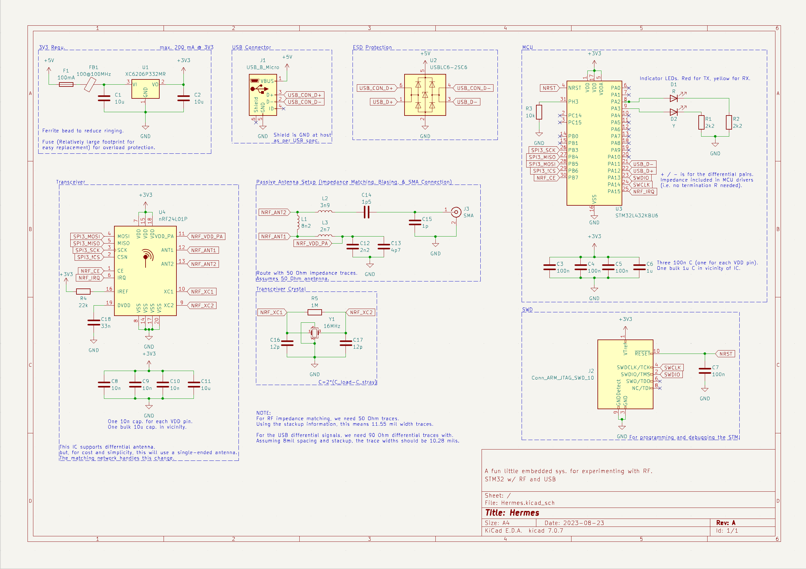

# Hermes

A small-form-factor, low-power, RF module with a programmable (SWD) STM32.  The goal of this project was to make a small board to mess around with RF and some basic DSP.

## Stack-up

I planned to manufacture this board through JLC PCB.  The service allows for fairly cost effective manufacturing with reasonable accuracy and constraints.  I decided to use an impedance-controlled, 4-layer stack-up because of the RF section (JLC04161H-7628).  This board is 1.6 mm thick with an outer copper weight of 1oz and inner copper weight of 0.5oz.  The stack-up information is important in determining the USB differential and RF antenna trace width and/or spacing. 

## Design Considerations
 

### USB Connection
I decided to use a micro-USB connection for this board.  I chose this connector mainly for its size.  I considered using USB-C since it's becoming more prevalent in modern electronics and similar in size.  However, USB-C has many connections which would not be useful in this case.  I did not need anything incredibly high-speed or with high power demand.  If one wanted to use USB-C with this board, it's possible to basically just swap out the connector and terminate it as per the USB-C specifications for USB-C to micro-USB.  If this is done, it may be wise to add current protection.  I left current protection out mainly to reduce the number of components, and the likelihood of micro-USB (due to the shape) having reverse current is incredibly low.  However, I did include ESD protection.

During board design, the USB uses differential signals.  The specification for this USB protocol is to have 90 Ohm impedance traces.  To do this, I assumed a trace spacing of 8 mils.  The spacing could be reduced, but I chose this for ease of manufacturing.  Using the stack-up information and the differential spacing, trace widths are calculated to be 10.28 mil.

### Power
The USB connection to a host device will provide the board with 5V.  However, most of the components on the board are designed for 3V3.  Thus, a voltage regulator will be needed.  I chose the XC6206P332MR.  This is an efficient LDO regulator.  I mainly chose this because it's simple, cost-effective, and low noise.

### Microcontroller
I chose to use the STM32L432KBU6 for this board.  It's low power and has a built in USB module.  This MCU doesn't have a ton of memory, but the chip will be used mainly to pass the RX/TX signal along and do basic processing.  So, it has more than enough memory for its intended use.  Additionally, the core speed is more than enough to handle the data with minimal delay.  It's important to note that while the trace lengths for the SPI interface are not exactly equal, the system can be considered to be "lumped".  Assuming even a 1ns rise time, which is much faster than expected for this setup, the critical length is around 41.1 mm.  The MCU traces for digital signals (excluding the diferential USB signals which are skew tuned as per USB specifications) are significantly shorter than this, so the differences in trace length won't cause problems.

### Transceiver
I chose the nRF24L01+ which is a 2.4GHz transceiver ([GFSK](https://en.wikipedia.org/wiki/Frequency-shift_keying#Gaussian_frequency-shift_keying)).  This transceiver contains basically everything needed to preform the functions of most consumer electronics, so it is more than enough for experimenting with.  It has good documentation, a decent amount of customizability, and doesn't use a ton of power.  The IC supports a variety of different antenna configurations, but I planned to connect a 2.4GHz passive antenna.  So I included the necessary matching and bias networks (assuming a 50 Ohm antenna) to meet the specifications as described by the data sheet.  Additionally, the IC requires a 16MHz crystal oscillator, so this is included.

To meet the impedance matching requirements, the antenna traces had to be 50 Ohms.  Using the stack-up information, the calculated trace width is 11.55mil.

## Datasheets
- [STM Datasheet](https://www.st.com/content/ccc/resource/technical/document/datasheet/24/01/9f/59/f0/83/47/fc/DM00257205.pdf/files/DM00257205.pdf/jcr:content/translations/en.DM00257205.pdf)
- [Transceiver Datasheet](https://www.sparkfun.com/datasheets/Components/SMD/nRF24L01Pluss_Preliminary_Product_Specification_v1_0.pdf)
- [ Linear and low-dropout regulator](https://www.mouser.com/datasheet/2/760/TOSL_S_A0007229533_1-2575067.pdf)
